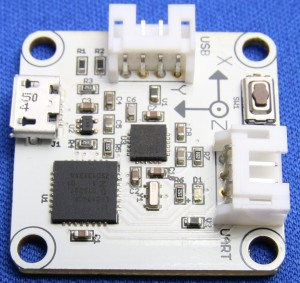
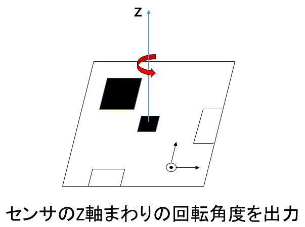
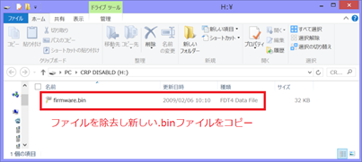

# RT-USB-9AXIS-NikkeiLinux

## 概要

本リポジトリは『Raspberry Pi で始めるかんたんロボット制作』で用いた
USB出力9軸IMUセンサモジュールのファームウェアの説明とダウンロード用
です.  

USB出力IMUセンサモジュールは株式会社アールティが製造・販売を行って
いるセンサモジュールになります.
このモジュールでは加速度, 角速度, 地磁気それぞれ3軸のデータをUSB経由で取得可能です.  

    [USB出力9軸IMUセンサモジュール](http://products.rt-net.jp/iot/usb9axisimu/)

日経Linuxの連載では本センサから角度を出力して, ロボットの制御を行う例を
紹介しております.  

Raspberry Pi Mouseはラズベリーパイを用いて制御可能な移動台車ロボットです.  
詳細は以下を参照してください.

    [Raspberry Pi Mouse](http://products.rt-net.jp/micromouse/raspberry-pi-mouse)

## 連載用ファームウェアと出荷時のファームウェアの相違点について

USB出力IMUセンサモジュールにはもともと9軸データを取得し送信し続ける処理を
するサンプルファームが書き込まれています.  

[USB出力9軸IMUセンサモジュールサンプルソフト等](http://www.rt-shop.jp/download/RT-IMU9/)

連載で使われているファームウェアではサンプルのファームウェアとは別のもので
センサを水平においた状態でその周りの角度値(度)を0.1秒毎にを出力し続けます.  

## ファームウェアの書き込み方法
連載用のファームウェアはfirmwareフォルダ内
「NikkeiLinux_yaw_firm.bin」になります.  
以下, ファームウェアの書き込み方法について説明します.  

### Windows環境

1.	9軸センサモジュール上のタクトスイッチを押したままUSBケーブルを接続.このとき, モジュール上のLEDが弱く点灯します.
2.	タクトスイッチから手を離します．
3.	ブートローダーの起動まで待機(CRP DISABLEDという新しいDiskとして認識されます.)
4.	もともとのfirmware.binを削除
5.	新しい.binファイルをコピー

### Linux環境

1.センサモジュール上のタクトスイッチを押したままUSBケーブルを接続
このとき, モジュール上のLEDが点灯します.
2.タクトスイッチから手を離します．
3.mountコマンドでマウント名を調べる.(CRP DISABLEDという名前)
4.mtoolというコマンドをインストールする.
5.sudo mdel –i マウントされている場所::/firmware.bin
6.sudo mcopy –i マウントされている場所 新しいファイルの絶対path::/

## ラズベリーパイでのセンサ値の出力読み取りについて
連載用のファームウェアの出力を読み出してみます.  

ラズベリーパイにセンサを

